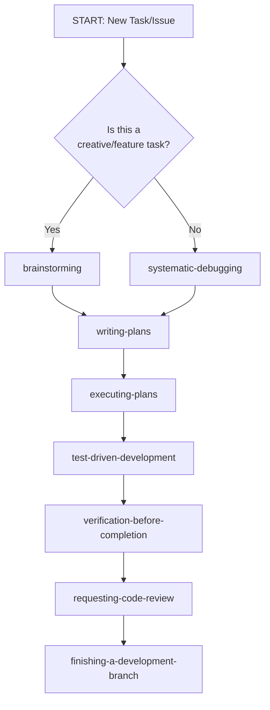

# AGENTS.md — learn-languages (Astro + GitOps + Superpowers)

> This document governs how AI agents operate in this repository. It encodes GitOps principles, Astro conventions, Superpowers skill workflows, SemVer 2.0, commit conventions, and platform governance rules.

---

## 1. Repository Purpose

**learn-languages** — A research-backed Portuguese (European PT-PT) learning platform built with **Astro 5.x** (static site generation with islands) deployed to **GitHub Pages** via **GitOps**.

- **Framework**: Astro 5.x + Vue 3 islands + TypeScript
- **Content**: Zod-validated CEFR nodes + language-pair realisations (YAML)
- **SRS**: SM-2 algorithm (pure TS, 100% test coverage)
- **Deployment**: GitHub Actions → GitHub Pages (static export)
- **Principles**: Evidence-based SLA, SDT motivation, cognitive load management, privacy by default

### 1.1 Delivery Stage

This project is **pre-validation**: zero real learners, biggest named risk is retention (discovery-brief.md R3 — "learners don't return after session 1"), not scale or supply-chain integrity. Process weight should match that:

- **Priority order:** a working EN→PT review loop in front of real learners beats a complete CEFR schema or exhaustive content inventory. Don't let schema/content perfectionism (Epic: Abstract Content Model, Epic: Language Pair Content Authoring) block getting a thin, ugly, working vertical slice in front of users.
- **CI gates** (`.github/workflows/pipe.yml`) are scoped to what a pre-launch static site needs: content validation, typecheck, lint, unit tests, build, deploy. SAST scanning, SBOM generation, and artifact signing were removed — reintroduce them when there's a real user base and a supply chain worth hardening, not before.
- **Skill workflow below** still applies to real feature/content-model work. It does not mean every spike, throwaway prototype, or "get this in front of a user by Friday" task needs the full ceremony — use judgment; a walking skeleton is allowed to be rough.

---

## 2. Superpowers Skill Workflow (MANDATORY for feature/content-model work)

All agents MUST follow the Superpowers skill sequence for feature and content-model work — see §1.1 for when lighter iteration is appropriate:

### 2.1 Skill Sequence



### 2.2 Required Skills by Task Type

| Task Type | Required Skills (in order) |
|-----------|---------------------------|
| New feature / design | `brainstorming` → `writing-plans` → `executing-plans` → `test-driven-development` → `verification-before-completion` → `requesting-code-review` |
| Bug fix | `systematic-debugging` → `writing-plans` → `test-driven-development` → `verification-before-completion` → `requesting-code-review` |
| Refactor | `writing-plans` → `test-driven-development` → `verification-before-completion` → `requesting-code-review` |
| Documentation | `writing-plans` → `executing-plans` → `verification-before-completion` |

### 2.3 Skill Invocation Rules

- **NEVER** skip `brainstorming` for new features — it explores intent before implementation
- **NEVER** skip `systematic-debugging` for bugs — root cause before fix
- **NEVER** write production code without a failing test first (`test-driven-development`)
- **NEVER** claim "done" without `verification-before-completion` (evidence before assertions)
- **ALWAYS** request code review via `requesting-code-review` before merge

### 2.4 Red Flags — STOP and Follow Process

If you catch yourself thinking:
- "This is simple, I'll just code it" → **Use `brainstorming` first**
- "I'll test after" → **TDD is mandatory**
- "Let me explore first" → **Skills define HOW to explore**
- "Quick fix for now" → **Systematic debugging required**

---

## 3. GitOps Principles (MANDATORY)

| Principle | Enforcement |
|-----------|-------------|
| **Declarative desired state** | All infra/app config in Git (Astro config, workflows, content schema) |
| **Single source of truth** | `main` branch = production state; no manual deployments |
| **Pull-based reconciliation** | GitHub Actions watches repo; deploys on push to `main` |
| **Immutable artifacts** | Build outputs (dist/) are ephemeral; only Git commits are permanent |
| **Environment separation** | GitHub Pages environments: Preview (PRs) / Production (main) |
| **Audit trail** | Every change = Git commit; CI logs = deployment evidence |
| **Rollback = revert** | `git revert` on main triggers rollback via Actions |

**Violations block merge.** See `.github/workflows/ci.yml`, `deploy.yml`.

---

## 4. Astro Conventions

### 4.1 Project Structure
```
src/
├── components/          # Reusable UI components (.astro, .vue)
├── content/
│   ├── cefr-nodes/      # Abstract CEFR Can-Do nodes (YAML, language-agnostic)
│   └── realisations/    # Language-specific expressions
│       └── pt-PT/       # Portuguese realisations
├── layouts/             # Page layouts (BaseLayout, LessonLayout)
├── lib/                 # Pure functions (SRS, storage, progress, i18n)
├── pages/               # File-based routing with i18n
│   ├── [sourceLang]/
│   │   └── [targetLang]/
│   │       ├── index.astro
│   │       ├── lessons/[nodeId].astro
│   │       ├── review.astro
│   │       └── progress.astro
├── styles/              # Global CSS, design tokens (CSS custom properties)
└── content.config.ts    # Zod schemas for content collections
```

### 4.2 Content Collections (Astro 5.x)
```typescript
// src/content.config.ts
import { defineCollection, z } from 'astro:content';

const cefrNodeSchema = z.object({
  nodeId: z.string().regex(/^(A1|A2|B1|B2|C1|C2)-[A-Z]+-\d{3}$/),
  cefrLevel: z.enum(['A1', 'A2', 'B1', 'B2', 'C1', 'C2']),
  skill: z.enum(['listening', 'reading', 'spoken_interaction', 'spoken_production', 'writing']),
  canDo: z.string().min(10).max(200),
  pragmaticFocus: z.string().optional(),
  notionalFocus: z.string().optional(),
  relatedNodes: z.array(z.string()).default([]),
  prerequisiteNodes: z.array(z.string()).default([]),
});

const vocabularyItemSchema = z.object({
  id: z.string().regex(/^[a-z]{2}(-[A-Z]{2})?-.+-\d{3}$/),
  term: z.string().min(1),
  translation: z.string().min(1),
  partOfSpeech: z.enum(['noun', 'verb', 'adjective', 'adverb', 'pronoun', 'preposition', 'conjunction', 'interjection', 'phrase']),
  gender: z.enum(['masculine', 'feminine', 'neuter', 'n/a']).default('n/a'),
  example: z.string().min(5),
  exampleTranslation: z.string().min(5),
  audioUrl: z.string().optional(),
});

export const collections = {
  'cefr-nodes': defineCollection({ type: 'data', schema: cefrNodeSchema }),
  realisations: defineCollection({ type: 'data', schema: realisationSchema }),
};
```

### 4.3 Styling: Vanilla CSS + Design Tokens + BEM
```css
/* src/styles/global.css */
:root {
  --color-bg: #fdfdfd;
  --color-surface: #ffffff;
  --color-text: #1a1a1a;
  --color-text-muted: #5a5a5a;
  --color-accent: #006b5e;      /* Portuguese green */
  --color-accent-hover: #005247;
  --font-body: 'Inter', system-ui, sans-serif;
  --space-1: 0.25rem; --space-2: 0.5rem; --space-3: 0.75rem;
  --space-4: 1rem; --space-6: 1.5rem; --space-8: 2rem;
  --radius-sm: 4px; --radius-md: 8px; --radius-lg: 16px;
}

/* BEM example */
.lesson-card { }
.lesson-card__title { }
.lesson-card__progress { }
.lesson-card--mastered { }
```
**No CSS frameworks.** No Tailwind, no styled-components.

### 4.4 Client Hydration: Islands Only
- Default: **zero-JS** static HTML
- Interactive islands: `client:load`, `client:visible`, `client:idle`
- FlashcardReview, ProgressDashboard = Vue islands
- PronunciationButton, LanguagePairSelector = vanilla JS islands

---

## 5. CI/CD Pipeline

### 5.1 Required Stages (`.github/workflows/ci.yml`)
```yaml
stages:
  - lint              # ESLint + Prettier (staged files via lefthook)
  - typecheck         # tsc --noEmit
  - validate:content  # Zod schema validation for all content
  - test:unit         # Vitest --run --coverage (thresholds: 90%)
  - build             # astro build (static export to dist/)
  - test:e2e          # Playwright critical paths
  - lighthouse        # Lighthouse CI (perf ≥95, a11y 100)
```

### 5.2 Gates
| Gate | Threshold |
|------|-----------|
| TypeScript | 0 errors |
| Lint | 0 errors, 0 warnings |
| Content Validation | 100% files valid |
| Unit Coverage | ≥90% lines, branches, functions |
| Build | Must succeed |
| E2E | All critical paths pass |
| Lighthouse | Perf ≥95, A11y 100 |

**Failed gate = pipeline stops.** No `continue-on-error`.

### 5.3 Deployment (`.github/workflows/deploy.yml`)
- Trigger: Push to `main` (after CI passes)
- Environment: `github-pages` (Production)
- Preview: PR-specific (optional, Cloudflare Pages)
- Rollback: `git revert` on main

---

## 6. Testing Strategy

### 6.1 Test Pyramid
| Layer | Tool | Target | Scope |
|-------|------|--------|-------|
| Unit | Vitest | ≥90% | `lib/` (SRS, storage, progress, pairLoader) |
| Content Validation | Zod + custom | 100% | All YAML files |
| Integration | Vitest + jsdom | Key flows | Pair loader + SRS + storage |
| E2E | Playwright | Critical paths | Review session, language switch, progress |
| Accessibility | axe-core | All pages | WCAG 2.1 AA |
| Performance | Lighthouse CI | All pages | Budgets per §10 of spec |

### 6.2 TDD Rules (test-driven-development)
- **RED**: Write failing test first (one behavior, clear name, real code)
- **Verify RED**: Watch it fail for the RIGHT reason
- **GREEN**: Minimal code to pass
- **Verify GREEN**: All tests pass, output pristine
- **REFACTOR**: Clean up, keep tests green

---

## 7. Security & Compliance

### 7.1 Privacy by Default
- **No PII collected** — no accounts, emails, names
- **No third-party trackers** — self-hosted analytics only (opt-in)
- **localStorage only** — no data leaves browser
- **No cookies** — GDPR compliant by design

### 7.2 Security Posture
| Concern | Mitigation |
|---------|------------|
| XSS | Astro escapes by default; Vue escapes interpolations; no `v-html` |
| Content injection | Zod strict validation; no `eval` |
| Dependency vulns | `npm audit` in CI; Dependabot enabled |
| Supply chain | Lockfile committed; CI uses `npm ci` |
| GitHub Actions | Least-privilege `permissions:` blocks |

---

## 8. Accessibility (WCAG 2.1 AA)

Mandatory for all PRs:
| Check | Tool |
|-------|------|
| Semantic HTML | axe-core (CI) |
| Color contrast | axe-core + manual |
| Focus management | Tab navigation test |
| ARIA labels | Manual review |
| Reduced motion | `@media (prefers-reduced-motion)` |

**No merge without passing `npm run test:a11y`**.

---

## 9. SemVer 2.0 Versioning (MANDATORY)

### 9.1 Version Format
```
MAJOR.MINOR.PATCH[-PRERELEASE][+BUILD]
```

### 9.2 Increment Rules
| Change Type | Version Bump | Example |
|-------------|--------------|---------|
| Breaking API/content schema change | MAJOR | 1.0.0 → 2.0.0 |
| New feature (backward compatible) | MINOR | 1.0.0 → 1.1.0 |
| Bug fix (backward compatible) | PATCH | 1.0.0 → 1.0.1 |
| Pre-release (alpha/beta/rc) | PRERELEASE | 1.0.0-alpha.1 |

### 9.3 Content Schema Versioning
- CEFR node schema changes = **MAJOR** (breaks content validation)
- New optional fields in realisations = **MINOR**
- Vocabulary item additions = **PATCH** (no schema change)

### 9.4 Release Process
1. Update `package.json` version per SemVer
2. Update `CHANGELOG.md` (Keep a Changelog format)
3. Tag: `git tag -a v{version} -m "Release v{version}"`
4. Push tag: `git push origin v{version}`
5. GitHub Actions builds and deploys automatically

---

## 10. Commit Conventions (Conventional Commits 1.0.0)

### 10.1 Format
```
<type>[optional scope]: <description>

[optional body]

[optional footer(s)]
```

### 10.2 Types
| Type | Description | Version Bump |
|------|-------------|--------------|
| `feat` | New feature | MINOR |
| `fix` | Bug fix | PATCH |
| `docs` | Documentation only | — |
| `style` | Formatting, no code change | — |
| `refactor` | Code restructure, no behavior change | — |
| `perf` | Performance improvement | PATCH |
| `test` | Adding/fixing tests | — |
| `chore` | Maintenance, deps, config | — |
| `ci` | CI/CD changes | — |
| `content` | Content additions/changes | PATCH* |

*Content changes that don't alter schema = PATCH

### 10.3 Scope (Optional)
- `feat(cefr): add A1-GREET-001 node`
- `fix(srs): handle EF floor correctly`
- `content(vocab): add 50 A1 terms`

### 10.4 Breaking Changes
```
feat(cefr)!: redesign node schema to support multi-skill

BREAKING CHANGE: nodeId format changed from A1-XXX-001 to A1-SKILL-001
```
**Footer required for breaking changes.**

### 10.5 Examples
```
feat(review): add four-grade SRS buttons (Again/Hard/Good/Easy)

fix(i18n): ensure TTS uses pt-PT voice not pt-BR

docs(spec): update CEFR mapping process in specification-design.md

content(vocab): add 30 A1 terms for greetings module

refactor(srs)!: simplify schedule() to pure function

BREAKING CHANGE: schedule() now returns new state object instead of mutating
```

---

## 11. Lefthook Git Hooks (MANDATORY)

> **Lefthook replaces Husky.** It's faster, deterministic, and better suited for staged-file workflows.

### 11.1 Installation
```bash
# Install globally or via npx
go install github.com/evilmartians/lefthook@latest
# OR add to package.json devDependencies and use npx lefthook
```

### 11.2 Configuration (`.lefthook.yml`)
```yaml
# .lefthook.yml
pre-commit:
  parallel: true
  commands:
    lint-staged:
      glob: "*.{ts,tsx,vue,astro,js,jsx,json,css,md,mdx,yaml,yml}"
      run: npx lint-staged
    typecheck:
      glob: "*.{ts,tsx,vue}"
      run: npx tsc --noEmit

pre-push:
  parallel: false
  commands:
    validate-content:
      run: npm run validate:content
    test-unit:
      run: npm run test:unit
    test-e2e:
      run: npm run test:e2e
```

### 11.3 lint-staged Config (in `package.json`)
```json
{
  "lint-staged": {
    "*.{ts,tsx,vue,astro,js,jsx,json,css,md,mdx,yaml,yml}": [
      "prettier --check"
    ],
    "*.{ts,tsx,vue,astro}": [
      "eslint --max-warnings 0"
    ]
  }
}
```

### 11.4 Hook Behavior

| Hook | Runs On | Purpose |
|------|---------|---------|
| `pre-commit` | Staged files only | Fast feedback: lint + format + typecheck on changed files |
| `pre-push` | All files | Heavy gates: content validation + unit tests + E2E before push |

**Rationale:** Pre-commit is fast (<10s) for staged files. Pre-push runs full validation before code reaches remote.

---

## 12. Agent Workflow Rules

### 12.1 Planning Agent
- Uses `discovery` → `spec` → `plan` skills
- Produces `tasks.json` with acceptance criteria tagged `test_type: unit|integration|e2e|live-system`
- Validates against `governance-alignment`, `spec-policy-validation`

### 12.2 Build Agent
- Implements tasks per `build` → `code-generation`
- Follows `component-workflow` for UI, `manifest-generation` for K8s (if applicable)
- **TDD enforced**: No production code without failing test first

### 12.3 Review Agent
- Runs `review` → `spec-compliance`, `design-compliance`, `code-quality`
- Validates `gitops-overlay`, `pipeline-policy`, `k8s-policy`
- Blocks on Critical/Important findings

### 12.4 Test Execution Agent
- Runs `test-execution` with appropriate sub-skills
- Reports coverage, passes/failures per acceptance criterion
- `verification-before-completion` required before "done"

---

## 13. Definition of Done

A task is **done** only when:

- [ ] All acceptance criteria pass (unit/integration/E2E/live-system)
- [ ] Coverage gates met (≥90% for lib/)
- [ ] Pipeline passes (lint, typecheck, content validation, test, build, lighthouse)
- [ ] Accessibility audit passes
- [ ] Code review approved (no Critical/Important open)
- [ ] Deployed to preview environment verified
- [ ] Documentation updated (README, CHANGELOG, spec if API changed)
- [ ] Commit message follows Conventional Commits
- [ ] Version bumped per SemVer (if user-facing change)

---

## 14. Key Commands

```bash
# Local dev
npm run dev              # Astro dev server
npm run build            # Static export to dist/
npm run preview          # Preview dist/ locally

# Quality gates
npm run typecheck        # tsc --noEmit
npm run lint             # eslint + prettier --check
npm run validate:content # Zod schema validation
npm run test:unit        # vitest --run --coverage
npm run test:e2e         # playwright test
npm run lighthouse       # lighthouse-ci

# Git hooks
npx lefthook install     # Install hooks
npx lefthook run pre-commit   # Manual pre-commit
npx lefthook run pre-push     # Manual pre-push

# GitOps validation
git status               # Check clean state
git log --oneline -10    # Recent commits
```

---

## 15. References

- **Discovery Brief**: `discovery-brief.md`
- **Specification & Design**: `specification-design.md`
- **Astro Docs**: https://docs.astro.build
- **GitOps Principles**: https://opengitops.dev
- **WCAG 2.1 AA**: https://www.w3.org/WAI/WCAG21/quickref/
- **SM-2 Algorithm**: https://www.supermemo.com/en/archives1990-2015/english/ol/sm2
- **CEFR Can-Do**: https://www.coe.int/en/web/common-european-framework-reference-languages
- **Conventional Commits**: https://www.conventionalcommits.org
- **SemVer 2.0**: https://semver.org
- **Superpowers Skills**: `.config/opencode/skills/` (brainstorming, writing-plans, executing-plans, test-driven-development, systematic-debugging, verification-before-completion, requesting-code-review, finishing-a-development-branch)

---

## 16. Project Documents

| Document | Purpose |
|----------|---------|
| `discovery-brief.md` | JTBD, personas, acceptance criteria, constraints |
| `specification-design.md` | Full technical specification (architecture, data model, SRS, UI, testing, deployment) |
| `AGENTS.md` | This file — agent governance, GitOps, conventions |
| `CLAUDE.md` | Symlink to AGENTS.md |
| `README.md` | Project overview for humans |
| `CHANGELOG.md` | Keep a Changelog format |

---

*Generated for learn-languages. Update when platform conventions evolve. All agents MUST read this file at session start.*